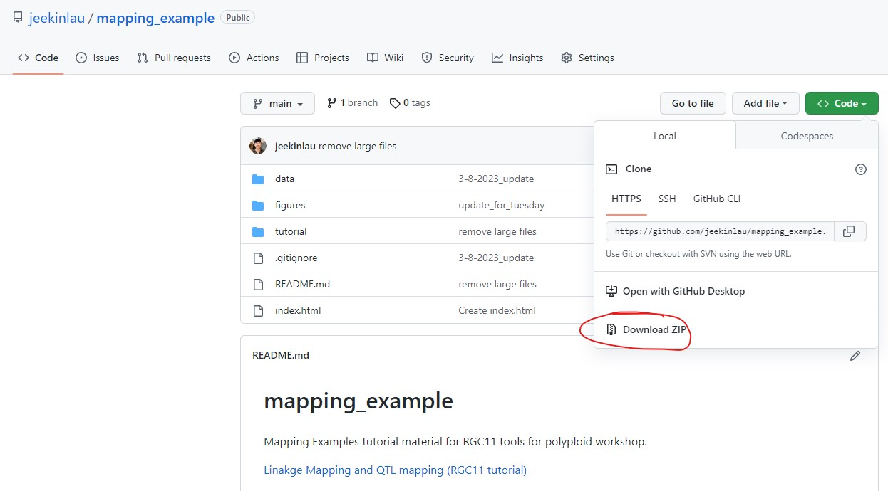

# mapping_example
Mapping Examples tutorial material for RGC11 tools for polyploid workshop.

[Linakge Mapping and QTL mapping (RGC11 tutorial)](https://jeekinlau.github.io/mapping_example/tutorial/Mapping_Example.html)

[GWASpoly (RGC11 tutorial)](https://jeekinlau.github.io/mapping_example/tutorial/gwas.html)

# Instructions
To follow along with the tutorials please either gitclone this repository or download the repository as a zip. Then unzip folder.

