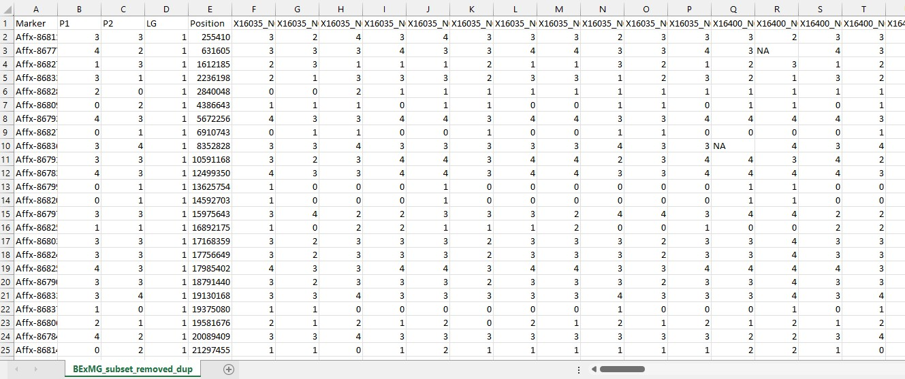
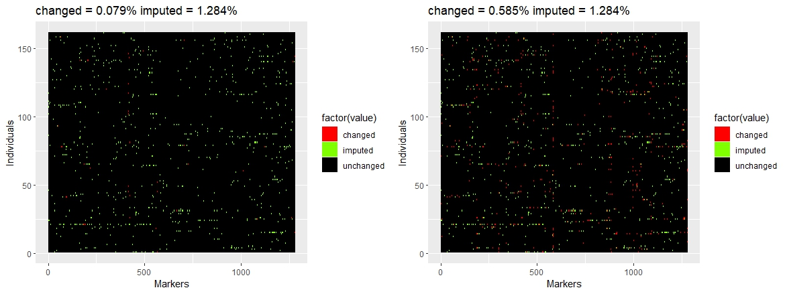

```{r set-options, echo=FALSE, cache=FALSE}
options(width = 100)

```

# Prerequisites

For this tutorial, you will need to install `mappoly` `polymapr` `qtlpoly` `viewpoly`. If you want to download the stable version and the versions please run the following lines.

    install.packages(c("mappoly","polymapR","qtlpoly","viewpoly"))

If you want to run the more experimental versions of the software, run following code:

    install.packages("devtools")
    devtools::install_github("mmollina/MAPpoly")
    devtools::install_github("gabrielgesteira/QTLpoly")
    devtools::install_github("mmollina/viewpoly")

# Introduction

This is a tutorial using a very clean dataset from a SNP array on a well characterized autotetraploid garden rose mapping population that has been published already [Rose Rosette Disease Resistance Loci Detected in Two Interconnected Tetraploid Garden Rose Populations](https://www.frontiersin.org/articles/10.3389/fpls.2022.916231/full)

To download the dataset please go to: <https://github.com/jeekinlau/mapping_example/tree/main/data>

**Tutorial link:**

-   <https://jeekinlau.github.io/mapping_example/tutorial/Mapping_Example.html>

**More in depth Tutorials from the developers**

**mappoly**

-   <https://rpubs.com/mmollin/tetra_mappoly_vignette>

-   <https://mmollina.github.io/tutorials/hexa_fake/haxaploid_map_construction.html>

**qtlpoly**

-   <https://gabrielgesteira.github.io/QTLpoly/docs/1-tutorial>

-   <https://guilherme-pereira.github.io/QTLpoly/2-tetraploid_example.html>

**viewpoly**

-   <https://cristianetaniguti.github.io/viewpoly_vignettes/VIEWpoly_tutorial.html>

**polymapR**

-   <https://cran.r-project.org/web/packages/polymapR/vignettes/Vignette_polymapR.html>

-   <https://cran.r-project.org/web/packages/polymapR/vignettes/Vignette_genotype_probabilities.html>

# Import the data

Download the dataset and import the dataset into R. The data is organized in a way that `mappoly` recognizes it. must be in this format if you want to use `mappoly::read_geno_csv()` to read in your data. If you have a vcf file you can also use `mappoly::read_vcf()`.

Normally in the `mappoly::read_geno_csv(filter.non.conforming=T)` but in this case below we set to`False` in order to do some preliminary QC done in `polymapR`.



```{r}
setwd("~/GitHub/mapping_example/tutorial")
library(mappoly)
dat = read_geno_csv(file="../data/BExMG_subset_with_contaminants_2075mrks.csv", ploidy = 4, filter.non.conforming = F)

```

## Importing VCFs
**This is not part of the tutorial. mappoly is able to take VCF files and this is just showing how to import data.**

```{r, eval=F}
dat_vcf = read_vcf("../data/sweetpotato_chr1.vcf.gz", parent.1 = "PARENT1", parent.2 = "PARENT2",ploidy = 6)
```

## QC

Here we will look for contaminants and duplicates and remove them from the analysis. Good idea because you have no idea what kind of errors you have in genotyping. We will use the functions the developers have implemented to help going between different software. What we will do here is use `polymapR` to find the contaminants and duplicate individuals and remove them from our analysis. We will produce a new genetic input file.

```{r}
library(polymapR)

polymapR_dosage_matrix=export_data_to_polymapR(dat)

PCA_progeny(polymapR_dosage_matrix)


contaminants = c("X16009_N001", "X16009_N010","SW","X16009_N005","X16009_N006","X16009_N009")


screened_data <- screen_for_duplicate_individuals(dosage_matrix = ALL_dosages, 
                                                   cutoff = 0.95, 
                                                   plot_cor = T)

duplicates =  c("X16035_N028.1", "X16035_N029.1","X16400_N023","X16400_N038","X16405_N113","X16400_N006")

remove = c(contaminants,duplicates)

genotype_data = read.csv("../data/BExMG_subset_with_contaminants_2075mrks.csv")
genotype_data_after_QC=genotype_data[,which(!colnames(genotype_data)%in%remove)]


write.csv(genotype_data_after_QC,"../data/BExMG_subset_with_contaminants_2075mrks_afterQC.csv", row.names = F)
```


**Read back in the new fixed genotype file**

```{r}
setwd("~/GitHub/mapping_example/tutorial")
library(mappoly)
dat = read_geno_csv(file="../data/BExMG_subset_with_contaminants_2075mrks_afterQC.csv", ploidy = 4, filter.non.conforming = T)

```

# Filtering Data

## Filter by missing data


Typically, there will be many markers filtered out when filtered by marker, or by individual. Because this is a very well curated dataset, There are no markers filtered out. Start with 0.05 or 0.10 but there are no "rules" for what level to use.

```{r}
## Filtering dataset by marker
dat = filter_missing(input.data = dat, type = "marker", 
                      filter.thres = 0.10, inter = F)

## Filtering dataset by individual
dat = filter_missing(input.data = dat, type = "individual", 
                      filter.thres = 0.10, inter = F)
dat
```

## Filter by segregation distortion

Also very few markers removed due to good dataset. The figure below shows the marker types, the dosage of all the marker types, and the segregation distortion of the markers. Here also we apply an alpha=0.05 with Bonfferoni correction.

```{r}
## Filter according to segregation test
pval.bonf = 0.05/dat$n.mrk
mrks.chi.filt = filter_segregation(dat, chisq.pval.thres =  pval.bonf, inter = F)
seq.init = make_seq_mappoly(mrks.chi.filt)
seq.init

plot(seq.init)
```

# Calculating recombination fractions

This step allows for the pairwise recombination fraction calculation between all markers. If you computer has multiple cores use the `parallel::detectCores()` function to find out how many cores your local computer has. This step takes a while especially with a laptop with limited cores and RAM memory. (**there are tricks around this email me for alternative strategies around this**)

```{r}
## Accounting for recombination fractions

all.rf.pairwise = est_pairwise_rf(input.seq = seq.init, ncpus = 6)

```

## Plotting RF matrix

Plotting the RF matrix shows a heat map of markers that are closely linked versus those that are far away. We see that those markers group into the 7 chromosomes of the Rose genome.

```{r}
mat = rf_list_to_matrix(all.rf.pairwise)
plot(mat)
```

# Grouping

Next step is to group the markers into a list containing the necessary objects needed for mapping (ie markers and their two point rf estimate and a sequence of markers). There are several ways to approach this. Below we compare the grouping using UPGMA method, genomic (physical position according to genome position), and an intersect between the two.

```{r}
## Getting group information (UPGMA)
grs = group_mappoly(input.mat = mat,
                     expected.groups = 7,
                     comp.mat = TRUE, 
                     inter = F)
grs
plot(grs)
```

```{r}
## Making groups with intersection between UPGMA (rf) + genomic information (discards scaffolds)

LGS.inter=vector("list", 7)
for(j in 1:7){
  temp1 = make_seq_mappoly(grs, j, genomic.info=1)
  tpt = make_pairs_mappoly(all.rf.pairwise, input.seq = temp1)
  temp2 = rf_snp_filter(input.twopt = tpt, diagnostic.plot = FALSE)
  tpt2 = make_pairs_mappoly(tpt, input.seq = temp2)
  LGS.inter[[as.numeric(names(table(temp2$chrom))[which.max(table(temp2$chrom))])]] = list(seq = temp2, tpt = tpt2)
}


## Making groups only with genomic information (tends to bring more markers, but also discards scaffolds)
LGS.genomic = vector("list", 7)
for (i in 1:7){
  tempseq1 = make_seq_mappoly(dat, arg = paste0("seq",i), genomic.info = 1)
  mrks = intersect(tempseq1$seq.mrk.names, seq.init$seq.mrk.names)
  tempseq = make_seq_mappoly(dat, arg = mrks)
  temptpt = make_pairs_mappoly(all.rf.pairwise, input.seq = tempseq)
  rffilt = rf_snp_filter(input.twopt = temptpt, diagnostic.plot = FALSE)
  temptpt2 = make_pairs_mappoly(temptpt, input.seq = rffilt)
  LGS.genomic[[as.numeric(unique(rffilt$chrom))]] = list(seq = rffilt, tpt = temptpt2)
}


## Making groups with UPGMA (rf) information (includes scaffolds)
LGS.upgma=vector("list", 7)
for(j in 1:7){
  temp1 = make_seq_mappoly(grs, j)
  tpt = make_pairs_mappoly(all.rf.pairwise, input.seq = temp1)
  temp2 = rf_snp_filter(input.twopt = tpt, diagnostic.plot = FALSE)
  tpt2 = make_pairs_mappoly(tpt, input.seq = temp2)
  LGS.upgma[[as.numeric(names(table(temp2$chrom))[which.max(table(temp2$chrom))])]] = list(seq = temp2, tpt = tpt2)
}


## Comparing number of markers in each group
comp = data.frame(UPGMA_Genomic = unlist(lapply(LGS.inter, function(x) length(x$seq$seq.num))),
                  Genomic = unlist(lapply(LGS.genomic, function(x) length(x$seq$seq.num))),
                  UPGMA = unlist(lapply(LGS.upgma, function(x) length(x$seq$seq.num))))
comp


```

We see that all three are very similar and for the purpose of this example lets just take the upgma grouping and run with that.

```{r}
LGS<-LGS.inter
```

# HMM chain

The HMM chain is used to order the markers. Below is a example of just ordering one chromosome. Later we will show how to parallelize this task by chromosome. (NOTE the map is only running quickly here because of the small number of markers and the good quality of the data)

```{r}
single_chrom <- est_rf_hmm_sequential(input.seq = LGS[[1]]$seq,
                               start.set = 3,
                               thres.twopt = 10,
                               thres.hmm = 50,
                               extend.tail = 30,
                               twopt = LGS[[1]]$tpt,
                               verbose = TRUE,
                               phase.number.limit = 20,
                               sub.map.size.diff.limit = 5)
```

```{r}
plot(single_chrom)
```

## Parallel construction of all 7 LGs

```{r}
## Performing parallel computation of hidden markov 
phasing_and_hmm_rf <- function(X){
  fl <- paste0("output_map_ch_", unique(X$seq$chrom), ".txt")
  sink(fl)
  map <- est_rf_hmm_sequential(input.seq = X$seq,
                               start.set = 3,
                               thres.twopt = 10,
                               thres.hmm = 50,
                               extend.tail = 30,
                               twopt = X$tpt,
                               verbose = TRUE,
                               phase.number.limit = 20,
                               sub.map.size.diff.limit = 5) 
  sink()
  return(map)
}


# 5% genotyping error
my.error.func<-function(X){
  x<-est_full_hmm_with_global_error(input.map = X, 
                                    error = 0.05, 
                                    tol = 10e-4, 
                                    verbose = FALSE)
  return(x)
}
#upgma
#hidden markov based off physical location
ptm <- proc.time()
cl <- parallel::makeCluster(7)
parallel::clusterEvalQ(cl, require(mappoly))
parallel::clusterExport(cl, "dat")
MAPs <- parallel::parLapply(cl,LGS, phasing_and_hmm_rf)
parallel::stopCluster(cl)


# account for error
cl <- parallel::makeCluster(7)
parallel::clusterEvalQ(cl, require(mappoly))
parallel::clusterExport(cl, "dat")
MAPs.err <- parallel::parLapply(cl,MAPs,my.error.func)
parallel::stopCluster(cl)

par(mfrow=c(2,1))
plot_map_list(MAPs, col = "ggstyle")
plot_map_list(MAPs.err, col = "ggstyle")
proc.time() - ptm
```

After constructing the maps a 5% global error rate is applied to the chain to allow for the chain to make small changes that correct for possible genotyping error. The difference is seen the the picture above where the second map is shorter indicating a better map.

```{r}
plot_genome_vs_map(MAPs.err, same.ch.lg = T)
summary_maps(MAPs.err)
```

# Genotypic probabilites for use in QTL mapping

Genotypic probabilites will be used in QTL mapping thus we need to save this for use in next session

```{r}
genoprob.err <- vector("list", 7)
for(i in 1:7)
   genoprob.err[[i]] <- calc_genoprob_error(input.map = MAPs.err[[i]], error = 0.05)

saveRDS(genoprob.err, file="genoprob.err.RDS")
```

# homolog prob

```{r}
homolog_probs = calc_homologprob(genoprob.err)

plot(homolog_probs, lg = 1, ind = 1)

```

# HMM chain changing and imputing genotypes

The HMM chain will make small changes to the progeny genotype calls (dosage) so it fits the better in the map. As you increase the global error rate, you allow the chain more freedom to make more changes. This is represented in the figure below. 


# QTLpoly for QTL analysis

MAPpoly's sister software QTLpoly was made to take the outputs of MAPpoly to do QTL mapping. There are two main ways in QTLpoly REMIM random-effect multiple interval mapping and FEIM fixed effect interval mapping.

## Import data

First we need the to read in the genotypic probabilites file `genoprob.err` object that was generated in the previous linkage mapping session.

```{r}
library(qtlpoly)

genoprob.err = readRDS(file="genoprob.err.RDS")

pheno = read.csv("../data/blackspot_cercospora_defoliation_RRD.csv", row.names = 1)

data = read_data(ploidy = 4, geno.prob = genoprob.err, pheno = pheno, step = 1)


# this step takes a long time so do not run import it
#data.sim = simulate_qtl(data = data, mu = 0, h2.qtl = NULL, var.error = 1, n.sim = 1000, missing = TRUE, seed = 123) 
#score.null = null_model(data = data.sim$results, n.clusters = 7, plot = NULL)
```

## Didactic example of one trait for teaching REMIM

The REMIM method consists of a few steps: this is a simplification for more math terms go here: <https://guilherme-pereira.github.io/QTLpoly/1-tutorial#Perform_QTL_detection> 1. Null model: model starts with no QTL 2. Forward search: QTL are added one at a time conditional to any previous if any QTL already in the model 3. Model optimization: each QTL is then tested again conditional to all other QTL under a more stringent threshold - steps 2 and 3 are repeated until no more QTL are added and dropped from model. 4. QTL profiling: score statistics are updated conditional to QTL that are retained

### 1. Null model

```{r}
null.mod <- null_model(data = data, pheno.col = 1 ,n.clusters = 4, plot = "null")
print(null.mod)
```

### 2. Forward search

```{r}
search.mod <- search_qtl(data = data, model = null.mod, w.size = 15, sig.fwd = 0.01, n.clusters = 4, plot = "search")
print(search.mod)
```

### 3. Optimize QTL

```{r}
optimize.mod <- optimize_qtl(data = data, model = search.mod, sig.bwd = 1e-04,  n.clusters = 4, plot = "optimize")
print(optimize.mod)
```

### 3. Profile QTL

```{r}
profile.mod <- profile_qtl(data = data, model = optimize.mod, d.sint = 1.5,  polygenes = FALSE, n.clusters = 4, plot = "profile")
```

```{r}
print(profile.mod)
print(profile.mod, sint="lower")
print(profile.mod, sint="upper")
```

### Plotting the QTL profiles

```{r}
plot_profile(data=data,model=profile.mod, sup.int = T) 
```

### Run all of the traits

Because the score.null object (genome wide significance levels) take so long to calculate, I have provided done it in advance. If you have a new map, or if you have a new experiment, you will need to recalculate.

```{r}
score.null = readRDS("../data/score.null.RDS")

remim.mod = remim(data, score.null = score.null, w.size = 15, sig.fwd = 0.2, sig.bwd = 0.05, n.clusters = 7)
plot_profile(data, remim.mod, sup.int = T)
plot_profile(data, remim.mod, sup.int = T, grid=T)
plot_sint(data,remim.mod)
```

`fit_model()` calculates all the QTL's variance components and estimates heritability of the QTL (comparable to the R-squared of the QTL)

```{r}
fitted.mod <- fit_model(data = data, model = remim.mod, probs = "joint", polygenes = "none")
summary(fitted.mod) #some reason this does not display right please run in the console to see results
```

### qtl_effects

`qtl_effects()` shows the user for each QTL what parental homolog is responsible for increasing or decreasing the phenotypic average.

```{r}
est.effects <- qtl_effects(ploidy = 4, fitted = fitted.mod)
plot(est.effects)
```

## Save results for visualization in Viewpoly

What we need to do is now save all the objects so that we can now look at a more beautiful output for mining your results.

```{r}
# linkage map file
save(MAPs.err,file = "../viewpoly_files/MAPs.err.RData")
save(data, file = "../viewpoly_files/QTLpoly_data.RData")
save(remim.mod, file = "../viewpoly_files/QTLpoly_remim.mod.RData")
save(est.effects, file = "../viewpoly_files/QTLpoly_est.effects.RData")
save(fitted.mod, file = "../viewpoly_files/QTLpoly_fitted.mod.RData") 
```


